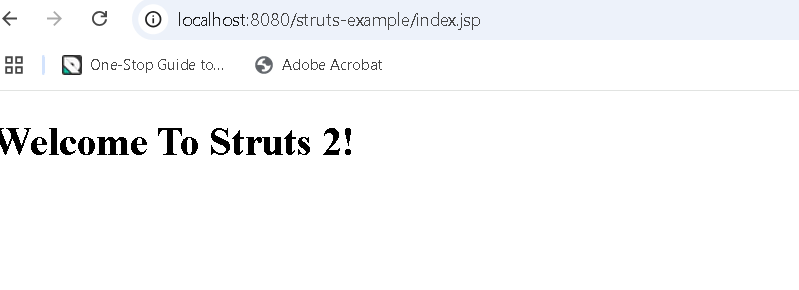

# Maven Dependency explanation

```Dependency	Used For	Scope	Why It's Needed
jakarta.servlet-api	Servlet classes (HttpServlet, Filter)	provided	Core for web apps
jakarta.servlet.jsp-api	JSP rendering	provided	Needed if using .jsp
jakarta.validation-api	Bean validation annotations (@NotNull)	—	Defines validation API
hibernate-validator	Runtime validation logic	—	Implements Jakarta Validation
jakarta.el	Expression Language (${})	—	Required for EL in JSP/validation
```

### If you’re using Tomcat 9 or older, use javax.* dependencies instead of jakarta.*.
### If you're using Tomcat 10+, the above jakarta.* dependencies are correct.


Thanks for the update. Since you're **still getting the error** about `jakarta.servlet.Filter` when running with **Smart Tomcat**, let’s troubleshoot this carefully — step by step.

---

## ❌ Problem Recap

You're getting this error:

```
java.lang.NoClassDefFoundError: jakarta/servlet/Filter
Caused by: java.lang.ClassNotFoundException: jakarta.servlet.Filter
```

Even though you **added the `jakarta.servlet-api` dependency**.

---

## ✅ 1. Confirm: Are You Using Tomcat 10+?

Smart Tomcat will **use the Tomcat version you configure**. Tomcat 10+ uses `jakarta.servlet.*`, not `javax.servlet.*`.

To verify:

- Go to **File → Settings → Smart Tomcat**
- Check the version of Tomcat you added
- If it’s **Tomcat 9**, then **jakarta.servlet.* won’t work** → use `javax.servlet-api` instead.
- If it’s **Tomcat 10+,** you must use the **Jakarta** namespace in **your app code and dependencies**

---

## ✅ 2. Fix Classpath Issue in Smart Tomcat

Even if your `pom.xml` includes:

```xml
<dependency>
    <groupId>jakarta.servlet</groupId>
    <artifactId>jakarta.servlet-api</artifactId>
    <version>6.1.0</version>
    <scope>provided</scope>
</dependency>
```

🔴 Maven marks it as "provided" — which **means it’s not included in the WAR**. Smart Tomcat may **not correctly pick up the Tomcat libs** as the container runtime.

---

### ✅ Workaround: Temporarily remove `scope`

To confirm if this is the issue, **remove `<scope>provided</scope>`** and re-run:

```xml
<dependency>
    <groupId>jakarta.servlet</groupId>
    <artifactId>jakarta.servlet-api</artifactId>
    <version>6.1.0</version>
    <!-- scope>provided</scope -->  ← remove or comment this line
</dependency>
```

Then:

1. Click **Build → Rebuild Project**
2. Restart the app via Smart Tomcat
3. Visit your servlet/JSP page again

✅ This will include the servlet API JAR in your `target/war/WEB-INF/lib`, ensuring the class is available at runtime.

---

## ✅ 3. Alternative: Switch to Tomcat 9

If you're **using Struts 2 or old Servlet code** (with `javax.servlet`), it's much easier to:

- Download **Tomcat 9** from [https://tomcat.apache.org/download-90.cgi](https://tomcat.apache.org/download-90.cgi)
- Add that to **Smart Tomcat settings**
- Use this dependency instead:

```xml
<dependency>
    <groupId>javax.servlet</groupId>
    <artifactId>javax.servlet-api</artifactId>
    <version>4.0.1</version>
    <scope>provided</scope>
</dependency>
```

✅ This avoids all Jakarta migration issues.

---

## 🧪 Bonus: How to Verify What's Inside Your WAR

Check if the required classes are present by opening:

```
target/yourApp.war → WEB-INF/lib
```

If there’s **no `jakarta.servlet-api-*.jar`** and Tomcat can’t find the `jakarta.servlet.Filter`, that confirms the issue.

---

## ✅ Final Fix Summary

| Use Case | Tomcat Version | Dependency to Use | Notes |
|----------|----------------|-------------------|-------|
| `javax.servlet.*` code (e.g., Struts 2 pre-2.6) | Tomcat 9 | `javax.servlet-api:4.0.1` | Easiest fix |
| `jakarta.servlet.*` code | Tomcat 10+ | `jakarta.servlet-api:6.1.0` | Use Jakarta APIs only |
| Using Smart Tomcat | Any | ❗ Avoid `scope=provided` if it's not resolving properly |

---


# access url :
http://localhost:8080/struts-example/index

it will return the 


